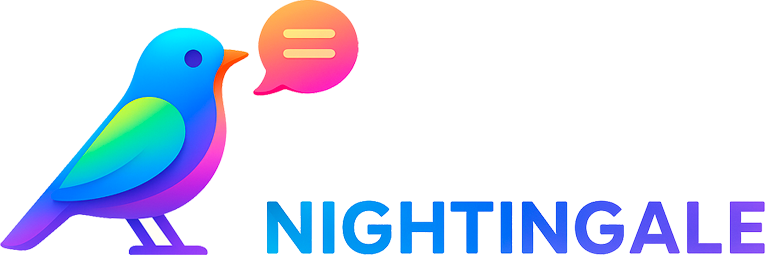

# Nightingale

Nightingale is a Ruby framework for building interactive data and AI web applications with a simple, declarative DSL. It brings the "script-as-app" experience (like Streamlit) to the Ruby ecosystem.

## Features

- **Ruby DSL**: Write your UI in pure Ruby.
- **Reactive**: Automatically updates the UI when you save your script.
- **Interactive**: Built-in widgets like sliders, buttons, and dataframes.
- **Modern Frontend**: React + Vite powered UI for a smooth experience.

## Installation

```bash
gem install nightingale
# Or add to your Gemfile
gem 'nightingale'
```

## Quick Start

1. Create a new app:
   ```bash
   nightingale new myapp
   cd myapp
   ```

2. Run the app:
   ```bash
   nightingale run app.rb
   ```

3. Edit `app.rb` and watch the magic happen!

## DSL Reference

### `title(text)`
Displays a large title.

### `markdown(text)`
Renders Markdown content.

### `button(label, key: nil)`
Renders a button. Returns `true` if clicked.

```ruby
if button "Click me"
  markdown "Clicked!"
end
```

### `slider(label, min:, max:, value: nil, step: 1, key: nil)`
Renders a slider. Returns the current value.

```ruby
val = slider "Select value", min: 0, max: 100
markdown "Value: #{val}"
```

### `dataframe(data)`
Displays a table of data (array of hashes).

```ruby
data = [{ name: "Alice", age: 30 }, { name: "Bob", age: 25 }]
dataframe data
```

### `session_state`
A hash-like object to store state across reruns.

```ruby
session_state[:count] ||= 0
session_state[:count] += 1 if button "Increment"
```

## Architecture

See [ARCHITECTURE.md](ARCHITECTURE.md) for details on how Nightingale works.

## Development

To set up the project for development (including installing Ruby gems and frontend dependencies):

```bash
bin/setup
```

To run the demo app during development:

```bash
bin/nightingale run examples/demo/app.rb
```

## License

MIT
